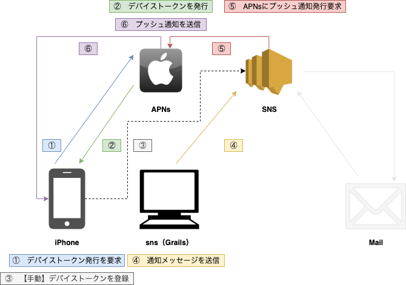

# sns
Grails練習用アプリ AmazonWebServiceのSimpleNotificationServiceを使ってみる。

## 機能
* 通知を送信
    * 任意の文字列か、あらかじめ設定しておいた文字列の通知を送信できる
    * メールアドレスに通知メッセージを送信できる
    * iOS端末に、プッシュメッセージを送信できる
        * 通知音あり or なし を設定できる
        * バッジあり or なし を設定できる
* 通知先を作成
    * 通知先のメールアドレスを追加できる
* ヘルプ
    * エラー対応など
## 構成図

## 課題・問題
* AWS-SNSの一部の機能しか使えてないので今後他の機能も使いこなす。
* デバイストークンを自動で登録できない。
## 謝辞
* [Frame illust](https://frame-illust.com/)
    * 初心者（若葉）マークの画像を使用させていただきました。ありがとうございます。
## 備考
```
Failed to register to APNs: Error Domain=NSCocoaErrorDomain Code=3000 "Appの有効な“aps-environment”エンタイトルメント文字列が見つかりません" UserInfo={NSLocalizedDescription=Appの有効な“aps-environment”エンタイトルメント文字列が見つかりません}
```


